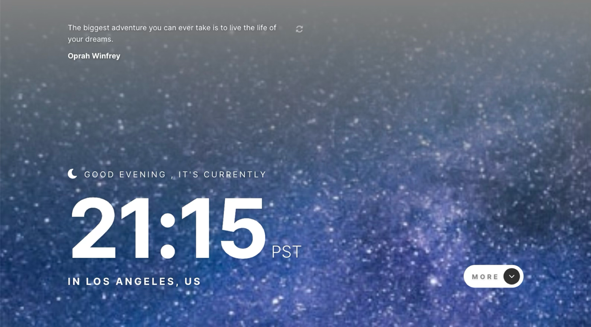
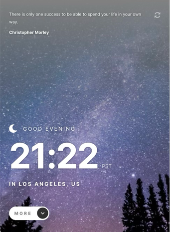
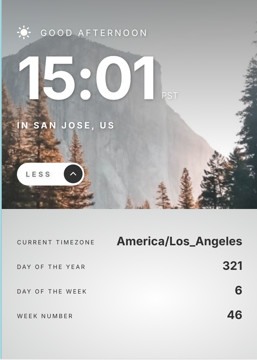

# 🕒 Clock Application

## Location-based Clock App

A modern location-based clock application built with React that greets users based on the time of day and displays current date and location information. Features an expandable section with additional time details and dynamic backgrounds that change between day and night modes.

🔗 **Live Demo**: [http://clock-app-eta.vercel.app/](http://clock-app-eta.vercel.app/)

## Key Features

- **Dynamic Time Display** - Shows current time based on user's location
- **Contextual Greetings** - Updates greeting message throughout the day
- **Location Detection** - Displays city and country based on IP geolocation
- **Expandable Details** - Additional time information in an expandable panel
- **Responsive Design** - Mobile-first approach works on all device sizes
- **Day/Night Theming** - Background changes automatically based on time

## 📱 Responsive Previews

| Desktop                 | Mobile                 | Mobile (Details Expanded)      |
| ----------------------- | ---------------------- | ------------------------------ |
|  |  |  |

## Quick Start

1. **Clone the repository**

   ```bash
   git clone <repository-url>
   cd clock-app
   ```

2. **Install dependencies**

   ```bash
   npm install
   ```

3. **Start the development server**

   ```bash
   npm run dev
   ```

4. **Build for production**

   ```bash
   npm run build
   ```

## Project Structure

```
clock-app/
├── src/
│   ├── assets/          # Static assets (images, fonts)
│   ├── components/      # Reusable UI components
│   ├── hooks/           # Custom React hooks
│   ├── layouts/         # Layout components
│   ├── store/           # State management
│   ├── utils/           # Utility functions
│   ├── main.tsx         # Application entry point
├── public/              # Static files
```

## Features

- **Time Display** - Shows current hour, minute, and timezone
- **Dynamic Greeting** - "Good morning", "Good afternoon", or "Good evening"
- **Location Information** - City and country name
- **Expandable Details** - Shows day of week, day of year, week number, etc.
- **Theme Toggle** - Automatic day/night themes with animation transitions
- **Mobile Responsive** - Adapts to all screen sizes

## Contributing

Contributions welcome! Feel free to open issues or submit pull requests.

## License

This project is licensed under the [MIT License](LICENSE).
